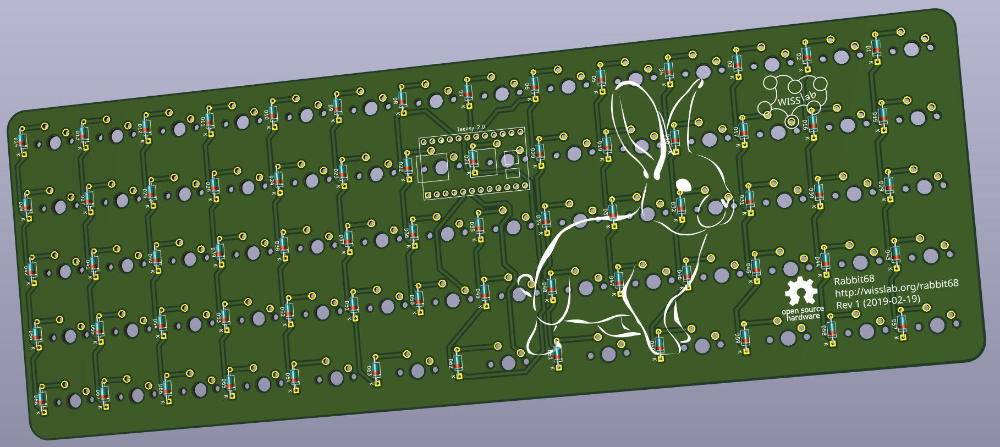

# The Rabbit68 Keyboard

## Layout

http://www.keyboard-layout-editor.com/#/gists/c885816c6b763c657e40474b015e362b

## Design Principles

- Basis for experiments and customization at low cost.
- Ortholinear
- Only keys without stabilizers, i.e., 1.75 U maximum.
- Key sizes that are available in a standard (blank) qwerty keycaps set.
- No SMD

## Piggybacked Teensy 2.0

The PCB uses a Teensy 2.0 as controller. This way the whole PCB is basically just to avoid handwiring.

## Similar projects

### Shark PCB
- https://github.com/Gondolindrim/SharkPCB
- https://www.reddit.com/r/MechanicalKeyboards/comments/a2s485/sharkpcb_design_stream/

### DIY Low Profile Ortho
- https://easyeda.com/7zark7/Kailh-Ortholinear
- https://imgur.com/a/gqjEYFf
- https://www.reddit.com/r/MechanicalKeyboards/comments/8sy17h/diy_low_profile_ortho/

## Guides
- https://github.com/ruiqimao/keyboard-pcb-guide
- https://kbwiki.ai03.me/books/pcb-design
